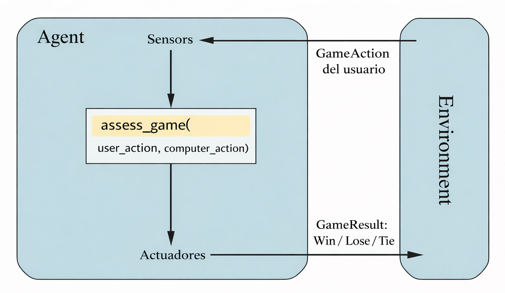

# Práctica Axentes Intelixentes

**rps_clase de Alejandro Cancelas Chapela**

# RPS

Proyecto de la especialidad **Inteligencia Artificial y Big Data** sobre la estructura de un agente para el juego **Piedra-Papel-Tijeras (RPS)**.  
Implementa un **agente secuencial de predicción por frecuencia** en Python, diseñado para detectar patrones del oponente y tomar decisiones inteligentes basadas en su historial de jugadas.

---

## Descripción

Se propone programar un agente inteligente que solucione el entorno de tareas del juego Piedra-Papel-Tijeras, siguiendo las directrices de modelado propuestas en el capítulo 2 *Intelligent Agents* del libro *IA: A Modern Approach*, de Russell & Norvig.

El proyecto sigue los principios **SOLID**, permitiendo extender la lógica a otras versiones del juego y futuras implementaciones de IA.

---

## Contorno de tareas

| Contorno de tareas | Observable | Agentes | Determinista | Episódico | Estático | Discreto | Conocido |
|-------------------|------------|---------|--------------|-----------|----------|----------|----------|
| RPS               | Parcialmente observable | Multiagente | Estocástico | Secuencial | Estático | Discreto | Conocido |

**Justificación:**

- **Observable:** Parcialmente observable. El agente no puede ver qué acción elegirá el rival.  
- **Agentes:** Multiagente. Competitivo, juega contra otro agente o humano.  
- **Determinista:** Estocástico. Los resultados dependen de las decisiones del rival y del azar.  
- **Episódico:** Secuencial. Cada decisión afecta a las rondas siguientes.  
- **Estático:** El entorno permanece estable hasta que el agente actúa.  
- **Discreto:** Las acciones son finitas (piedra, papel, tijeras).  
- **Conocido:** El agente conoce previamente las reglas del juego.  

---

## Estructura del agente

El agente se ha diseñado como **agente reactivo basado en modelos**. Su arquitectura incluye:

1. **Sensores (Captura de percepciones):** Reciben la acción del usuario y la transforman en datos procesables.  
2. **Estado Interno (Modelo del Mundo):** Mantiene un historial de interacciones, permitiendo al agente recordar patrones previos.  
3. **Evolución del Mundo (Lógica Predictiva):** Analiza el historial para estimar la acción más probable del rival.  
4. **Reglas de Condición-Acción (Mapeo de Decisión):** Decide la acción óptima basada en la predicción.  
5. **Actuadores (Ejecución):** Devuelve la acción seleccionada y actualiza el estado del entorno.

---

## Implementación en Python

El código se construye con **modularidad y separación de responsabilidades**:

- **Separación de responsabilidades (SRP):** Cada módulo tiene una función clara: reglas del juego, decisiones del agente, interacción con el usuario.  
- **Diseño extensible (OCP):** Permite añadir nuevos gestos como Lagarto o Spock simplemente actualizando la tabla de victorias.

**Funcionamiento del agente:**

1. De 1 a 5 rondas, elige acciones aleatorias.  
2. A partir de la ronda 6, analiza la frecuencia de las jugadas del usuario:  
   - Calcula el porcentaje de cada acción.  
   - Identifica la acción más frecuente.  
   - Si la frecuencia supera 0.40, predice la repetición del patrón y selecciona la acción que maximiza la victoria.  
   - Si no hay patrón claro, mantiene aleatoriedad para robustez.

El historial de jugadas se guarda en memoria, transformando el entorno de episódico a secuencial.

---

## Mejoras y extensiones

- Se puede extender la lógica a la versión **Piedra-Papel-Tijeras-Lagarto-Spock** sin reestructurar el agente.  
- Modularidad y separación de responsabilidades permiten futuras mejoras en la IA del agente.  
- La documentación está generada automáticamente con **Sphinx**, usando `autodoc` y `napoleon` para integrar docstrings de Python.

---

## Estructura de directorios

    rps/
    ├── data/                       # Datos de prueba o recursos externos (opcional)
    ├── docs/                       # Documentación del proyecto
    │   ├── build/                  # Archivos generados por Sphinx (HTML, doctrees)
    │   ├── docs/                   # Documentación fuente Sphinx (conf.py, .rst, _static)
    │   │   └── source/
    │   │       ├── conf.py         # Configuración de Sphinx
    │   │       ├── modules.rst     # Documentación de módulos generada automáticamente
    │   │       ├── rps.rst         # Documentación de código RPS
    │   │       └── _static/        # Archivos estáticos (CSS, JS, imágenes)
    │   ├── index.rst               # Documento principal para Sphinx
    │   ├── make.bat                # Script para compilar en Windows
    │   ├── Makefile                # Makefile para compilar documentación
    │   └── source/                 # Otra fuente de documentación (generada por sphinx-apidoc)
    │       ├── modules.rst
    │       └── rps.rst
    ├── pyproject.toml              # Configuración del proyecto Python (dependencias, build, metadata)
    ├── README.md                   # Descripción general del proyecto
    ├── src/                        # Código fuente
    │   ├── rps/                    # Módulo principal del juego
    │   │   ├── __init__.py
    │   │   └── main.py             # Implementación del agente y lógica del juego
    │   └── test/                   # Tests del proyecto
    │       ├── __init__.py
    │       └── test_proba.py
    └── uv.lock                     # Lock file generado por Hatch (gestor de entornos)

